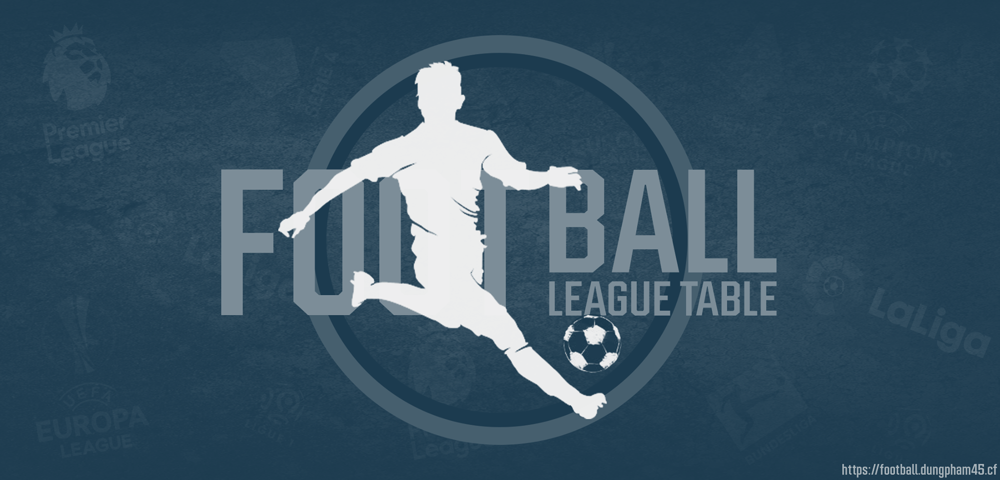

# Football Web

A modern, beautiful web app for exploring football (soccer) leagues and cups: standings, top scorers, and top assists. Built with Flask, MongoDB, and the API-Football service.



## Features

- View standings, top scorers, and top assists for major European leagues and international cups
- Beautiful, responsive UI with modern design
- Fast data loading with MongoDB caching
- Player and team info with images and stats
- API-Football integration for up-to-date data

## Tech Stack
- **Backend:** Python, Flask
- **Frontend:** HTML, CSS (custom, W3CSS), Jinja2
- **Database:** MongoDB (for caching API data)
- **API:** [API-Football](https://www.api-football.com/)

## Setup & Installation

1. **Clone the repository:**
   ```bash
   git clone https://github.com/yourusername/football-web.git
   cd football-web
   ```

2. **Install dependencies:**
   ```bash
   pip install -r requirements.txt
   ```

3. **Set up environment variables:**
   - Copy `.env.example` to `.env` and fill in your API-Football credentials:
     ```
     x-rapidapi-host=YOUR_API_FOOTBALL_HOST
     x-rapidapi-key=YOUR_API_FOOTBALL_KEY
     ```

4. **Start MongoDB:**
   - Make sure MongoDB is running locally (default: `mongodb://localhost:27017/`).

5. **Run the app:**
   ```bash
   python app.py
   ```
   The app will be available at [http://localhost:5000](http://localhost:5000)

## Usage
- Select a league/cup and season on the homepage.
- View standings, top scorers, or top assists.
- Click on teams or players for detailed info.
- Enjoy a fast, visually appealing football stats experience!

## Customization
- Edit `static/style.css` and `static/header-style.css` for UI tweaks.
- Add or update league/cup logos in `static/league_logo/`.
- Background images are in `static/background/`.

## License
MIT